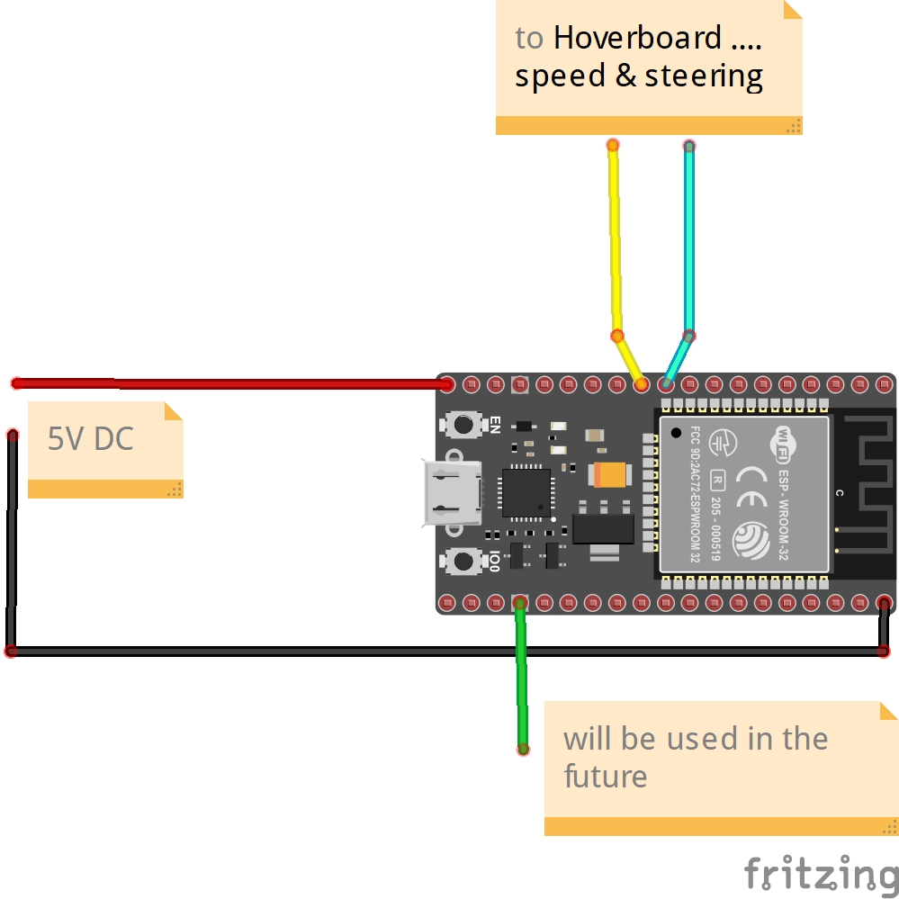
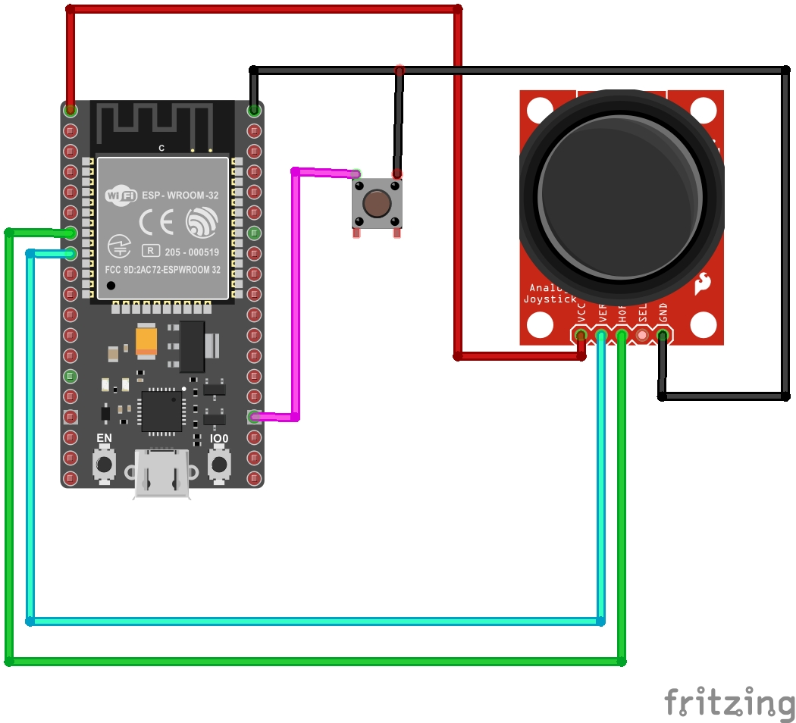

# Remote-control-for-Hoverboard-
Radio control of the hoverboard using the ESP-NOW protocol. This repository contains code for 3 channel  transmitter and receiver.
Receiver

Transmitter

In the Arduino IDE, add to the board manager - https://dl.espressif.com/dl/package_esp32_index.json

First you need to determine the MAC address of the receiver. To do this, use "GetMacAddress.ino" Then proceed to the firmware of the transmitter and receiver.

In the second release, port monitoring was added for debugging.

An example of the work on my channel https://youtu.be/sdt3OQeafr4

Description of the firmware of the hoverboard boards https://github.com/EFeru/hoverboard-firmware-hack-FOC.git
