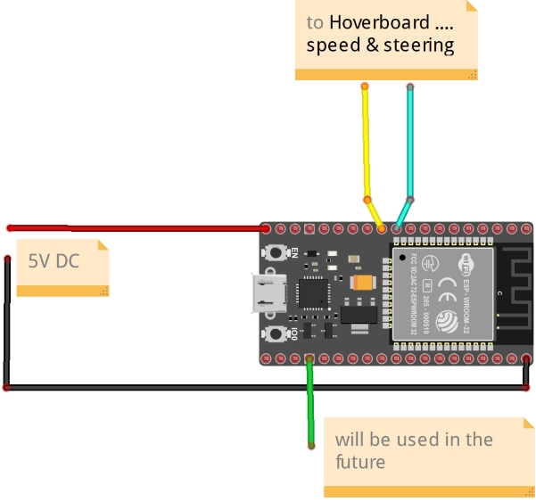
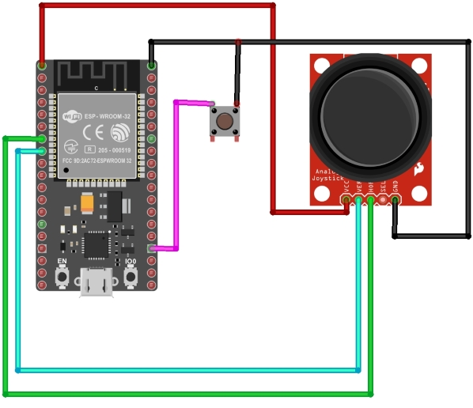

# Remote-control-for-Hoverboard-
Radio control of the hoverboard(or RC models also) using the ESP-NOW protocol. This repository contains code for 3 channel  transmitter and receiver. **The board must be under PWM mode.**

----------

**Receiver**

**Transmitter**

---------

Arduino IDE
In the Arduino IDE, add to the board manager - https://dl.espressif.com/dl/package_esp32_index.json

-----------
First you need to determine the MAC address of the receiver. To do this, use "GetMacAddress.ino" Then proceed to the firmware of the transmitter and receiver.
Description of the firmware of the hoverboard boards https://github.com/EFeru/hoverboard-firmware-hack-FOC.git

An example of the work on my channel https://youtu.be/sdt3OQeafr4
